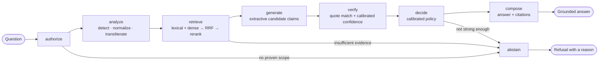
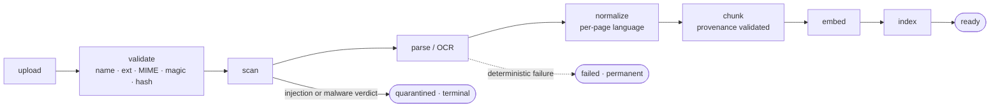
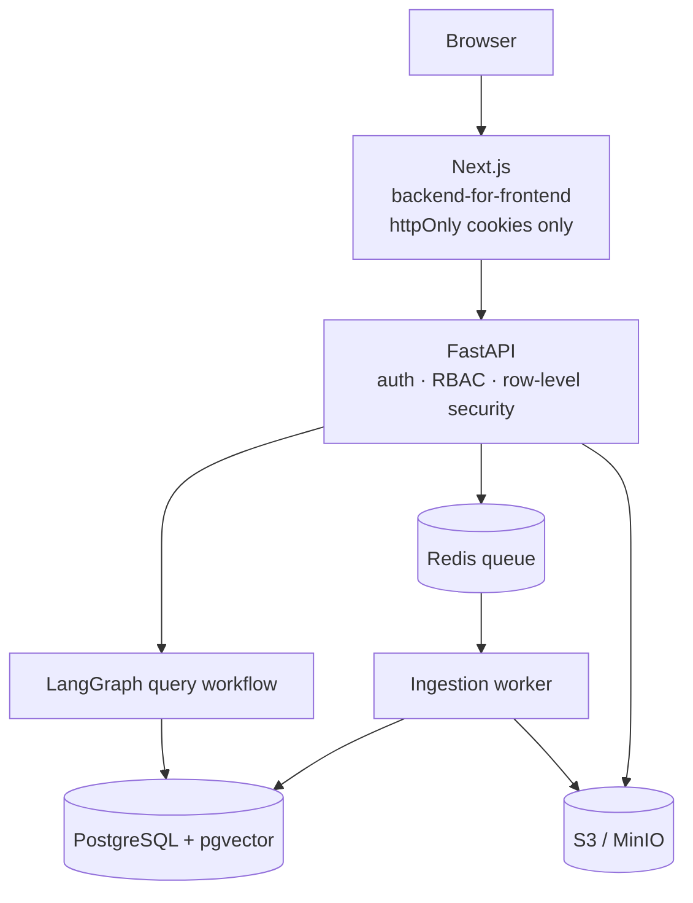

<div align="center">

# Attest Guardian

**Document intelligence that proves its answers.**

Tamil · Tanglish · English

<!-- One source line on purpose: inside a centred HTML block GitHub turns each newline into a <br>, which stacks the badges vertically. -->

[](https://github.com/imthi16/attest-guardian/actions/workflows/ci.yml) [](./apps/api/pyproject.toml) [](./apps/api/pyproject.toml) [](./apps/web/package.json) [](./docker-compose.yml)

</div>

---

## Every answer arrives with its coordinates

Ask a question and you get back a claim, the document it came from, and the exact character range
that supports it. Open the citation and the platform re-reads the stored text at those offsets:

```text
claim        An employee resigning from a permanent role must give 60 days written notice.
source       travel-expense-policy.pdf · version 1 · page 1
citation     characters 139–215
evidence     re-read from stored content at those offsets, and required to match exactly
verdict      SUPPORTED · checked by entailment-verifier-v1
confidence   Low (42%) · banded, and computed from retrieval, rerank, OCR, and query overlap
```

That is not a description of the design. It is the capture below, field for field:


The highlighted text was **read out of storage at those offsets when the panel was opened**. It is
not the quote the answer produced — a quote that failed to match renders a failure notice here
instead of a passage. That distinction is the whole product, and
[`docs/screenshots/`](./docs/screenshots/README.md) records what each capture does and does not
establish.

---

## Where to look, by how long you have

This is a large repository. If you are evaluating it rather than running it, these are the shortest
paths to the parts that carry actual engineering decisions.

| You have | Read | Because it shows |
| --- | --- | --- |
| **2 min** | [Measured behaviour](#measured-behaviour) | Every guarantee has a number, a floor, and a failing case left visible |
| **10 min** | [`docs/DESIGN_RATIONALE.md`](./docs/DESIGN_RATIONALE.md) | Why each guarantee exists, and what keeping it cost elsewhere |
| **30 min** | [`docs/EVALUATION.md`](./docs/EVALUATION.md) | Digest-pinned datasets, and two defects the framework found |
| **An hour** | [`AGENTS.md`](./AGENTS.md), [`docs/THREAT_MODEL.md`](./docs/THREAT_MODEL.md) | The rules the code is held to, and what is out of scope |
| **A terminal** | [Quick start](#quick-start) | Ten minutes to a grounded answer on your own document |

---

## What it refuses to do

A document assistant that is fluent and occasionally wrong is worse than one that is blunt and
always checkable, because nothing in a fluent wrong answer tells the reader which one they got.
Every row below is a place that asymmetry changed a decision.

| Common behaviour | What this system does instead |
| --- | --- |
| Answers from the model's memory when retrieval is thin | Abstains at an explicit evidence-sufficiency gate before generation runs |
| Cites a document and page | Cites a chunk, version, page, section, and character offsets, and re-reads the stored text to prove the quote |
| Shows the quote the model produced | Shows `content[start:end]` read back from the document; a mismatch renders a failure, never the passage |
| Reports the model's own confidence | Calibrates confidence from retrieval, rerank, OCR, and overlap signals; a model's self-report is never a score |
| Treats retrieved text as context | Treats retrieved text as untrusted data, scanned for injection before a chunk is persisted |
| Splits Tamil with `\w`-based tokenizers | Uses a mark-aware tokenizer, because a Tamil vowel sign is a combining mark and `\w` drops it |
| Filters documents in the UI | Enforces the tenant boundary in repositories and in PostgreSQL row-level security |

---

## Measured behaviour

Measured on every CI run against a versioned synthetic corpus, with floors declared in
[`evaluation/thresholds.json`](./evaluation/thresholds.json) and a committed baseline asserted equal
to a fresh run — so the numbers below cannot quietly become fiction.

| Metric | Measured | Floor |
| --- | --- | --- |
| Retrieval Recall@3 / MRR | 1.00 / 1.00 | 1.00 / 0.90 |
| Answer correctness / faithfulness | 1.00 / 1.00 | 0.90 / 1.00 |
| Citation precision / recall / resolvable | 1.00 / 1.00 / 1.00 | 0.90 / 0.90 / 1.00 |
| Abstention precision / recall | 1.00 / **0.86** | 0.90 / 0.80 |
| Injection recall / precision | 1.00 / 1.00 | 1.00 / 1.00 |
| Tenant-isolation containment | 1.00 | 1.00 |

> [!NOTE]
> **0.86 is the honest number.** One of seven unanswerable questions is answered from a passage that
> mentions the topic without addressing it. The case fails; the floor does not — 0.86 clears the
> declared 0.80, so CI is green and the defect is real anyway. The dataset was left exposing it
> rather than adjusted until it disappeared, and it is the most valuable number in the report to
> improve.

[`docs/EVALUATION.md`](./docs/EVALUATION.md) records what each metric excludes, why an unmeasurable
metric is `null` rather than `1.0`, and the two defects the framework found in the platform itself.

---

## Quick start

Prerequisites: Python 3.12+, Node.js 22, Docker with Compose v2, GNU Make, Git.

```bash
cp .env.example .env       # local-only credentials; never reuse them anywhere else
make install               # apps/api/.venv + npm ci for apps/web
make infra-up              # PostgreSQL(+pgvector), Redis, MinIO, and the local bucket
make migrate-up            # apply the schema
```

Then run the three processes, each in its own terminal:

```bash
make dev-api               # http://127.0.0.1:8000
make dev-worker            # ingestion
make dev-web               # http://127.0.0.1:3000
```

> [!IMPORTANT]
> `make dev-worker` is the one whose absence is invisible. Without it, uploads are accepted and
> never processed while the API stays genuinely healthy — documents sit at `queued` forever and no
> error appears anywhere.

Open `http://127.0.0.1:3000`, register an account, create a workspace, upload a PDF, wait for it to
reach **ready**, and ask a question. [`docs/DEMO.md`](./docs/DEMO.md) is a guided walkthrough of what
to look at and why.

Run `make check` before considering any change done: formatting, linting, strict typing, both test
suites with their coverage floors, the evaluation, the production build, and Compose validation.
`make help` lists every target.

**No Docker?** `make demo-api` starts an in-memory stand-in implementing the auth and workspace
contracts, so the UI can be driven without infrastructure — local viewing only, see
[`docs/DEVELOPMENT.md`](./docs/DEVELOPMENT.md#viewing-the-ui-without-docker).

---

<details>
<summary><b>How it works</b> — the query graph, the ingestion pipeline, and the topology</summary>

<br>

The query path is a typed LangGraph state machine whose gates are the graph's own conditional edges,
so no code path reaches generation without passing them:



Documents become evidence through an asynchronous worker, one stage per committed transition, so
`GET .../documents/{id}/status` shows real progress rather than a spinner:





Every subsystem and the reasoning behind it is in
[`docs/ARCHITECTURE.md`](./docs/ARCHITECTURE.md).

```text
apps/api/          FastAPI service: auth, RBAC, documents, ingestion, retrieval, RAG, safety
apps/web/          Next.js App Router client; a backend-for-frontend, never a token holder
services/          Boundary READMEs for ingestion, retrieval, verification, safety
packages/          contracts/openapi.json — the pin between the two programs; config; observability
infra/             Alembic migrations, row-level security, Grafana dashboard, Prometheus rules
evaluation/        Datasets, digests, thresholds, and the committed baseline report
deploy/            Production Compose overlay
docs/              Everything in the table below
tests/             Cross-cutting unit, integration, and evaluation suites
```

</details>

<details>
<summary><b>What is implemented</b> — every subsystem, and which adapters are stand-ins</summary>

<br>

Everything below runs today and is covered by tests; nothing here is aspirational. The adapters
marked *stand-in* are deterministic local implementations behind the real interface — swapping in a
hosted model changes no calling code. [`docs/ROADMAP.md`](./docs/ROADMAP.md) enumerates what is
deliberately not built.

| Area | State |
| --- | --- |
| Accounts, sessions | Argon2id passwords, HS256 access tokens, rotating refresh tokens with reuse detection, per-IP rate limits |
| Tenancy | Workspaces, four roles, one capability matrix, repository scoping, PostgreSQL row-level security |
| Upload | Filename/extension/MIME/content-magic validation before any byte reaches storage, SHA-256 dedupe, quotas, presigned downloads |
| Ingestion | Redis-queued worker, compare-and-set claims, per-stage commits, retries, dead-letter, stale-job recovery |
| Parsing, OCR | `pypdf` → `pypdfium2` fallback, DOCX, text; Tesseract and PaddleOCR adapters behind one protocol; absent engine records `unavailable` rather than inventing text |
| Chunking | Section hierarchy, atomic tables, offsets validated against the page text before persistence |
| Language | Tamil/English/Tanglish detection, NFC normalization, Tanglish→Tamil transliteration, mark-aware tokenizer |
| Retrieval | PostgreSQL full-text + pgvector cosine, reciprocal-rank fusion, authorization applied before scoring |
| Reranking | Cross-encoder-shaped interface; local lexical reranker *(stand-in)* |
| Embeddings | 1024-dim provider interface; local hashing provider *(stand-in)*; version-scoped vector search |
| Answers | LangGraph pipeline with three hard gates, extractive generator *(stand-in)*, per-claim citations |
| Verification | Per-claim quote resolution against the authorized chunk set, calibrated confidence, unsupported claims dropped |
| Abstention | Explicit decisions with reasons — no evidence, needs narrowing, contradictory, needs review |
| Safety | Prompt-injection detection over normalized text, quarantine before chunk persistence, retrieval excludes quarantined content |
| Conversations | Durable threads, ordered turns, SSE streaming, per-claim citations and verdicts, reviewer feedback |
| Web app | Next.js App Router; tokens never leave server code; explicit loading/empty/refusal/error states; evidence panel |
| Evaluation | Versioned corpus, digest-pinned datasets, thresholds in one file, committed baseline asserted against a fresh run |
| Observability | Redaction-in-the-formatter JSON logs, W3C trace context across the queue, Prometheus metrics, Grafana dashboard |
| Deployment | Compose production overlay, preflight, smoke checks, backup/restore, rollback runbook |

</details>

---

## Documentation

| Document | Read it for |
| --- | --- |
| [`docs/DESIGN_RATIONALE.md`](./docs/DESIGN_RATIONALE.md) | Why each guarantee exists, and what it cost to keep |
| [`docs/ARCHITECTURE.md`](./docs/ARCHITECTURE.md) | Every subsystem and the reasoning behind it |
| [`docs/API.md`](./docs/API.md) | The HTTP surface, capabilities, and stable error codes |
| [`docs/DEVELOPMENT.md`](./docs/DEVELOPMENT.md) | Local setup, migrations, test suites, contract drift |
| [`docs/CONFIGURATION.md`](./docs/CONFIGURATION.md) | Every environment variable and its consequences |
| [`docs/SECURITY.md`](./docs/SECURITY.md) | Implemented controls and residual risks |
| [`docs/THREAT_MODEL.md`](./docs/THREAT_MODEL.md) | Assets, actors, trust boundaries, and what is out of scope |
| [`docs/EVALUATION.md`](./docs/EVALUATION.md) | How the promises are measured and what the numbers exclude |
| [`docs/OBSERVABILITY.md`](./docs/OBSERVABILITY.md) | Logs, metrics, traces, and what must never be labelled |
| [`docs/DEPLOYMENT.md`](./docs/DEPLOYMENT.md) | Deploy, roll back, back up, restore |
| [`docs/DEMO.md`](./docs/DEMO.md) | A scripted walkthrough of the trust guarantees |
| [`docs/ROADMAP.md`](./docs/ROADMAP.md) | Delivered work, known limitations, and what comes next |
| [`AGENTS.md`](./AGENTS.md) | The non-negotiable engineering rules, authoritative for the repo |
| [`CONTRIBUTING.md`](./CONTRIBUTING.md) | How to propose a change that can be reviewed |

---

## Status

Issues [#1–#26](https://github.com/imthi16/attest-guardian/issues) are complete: the platform runs
end to end, from registration through ingestion, retrieval, grounded answering, verification,
abstention, injection defence, evaluation, observability, and a documented deployment.

It is a portfolio-scale system, not a production service. The model adapters are deterministic
stand-ins, rate limiting is per process, and no collector is wired to the metrics. Those gaps are
enumerated rather than implied — [`docs/ROADMAP.md`](./docs/ROADMAP.md) is the index of everything
this does not do.

Report a suspected vulnerability privately; see [`SECURITY.md`](./SECURITY.md).
