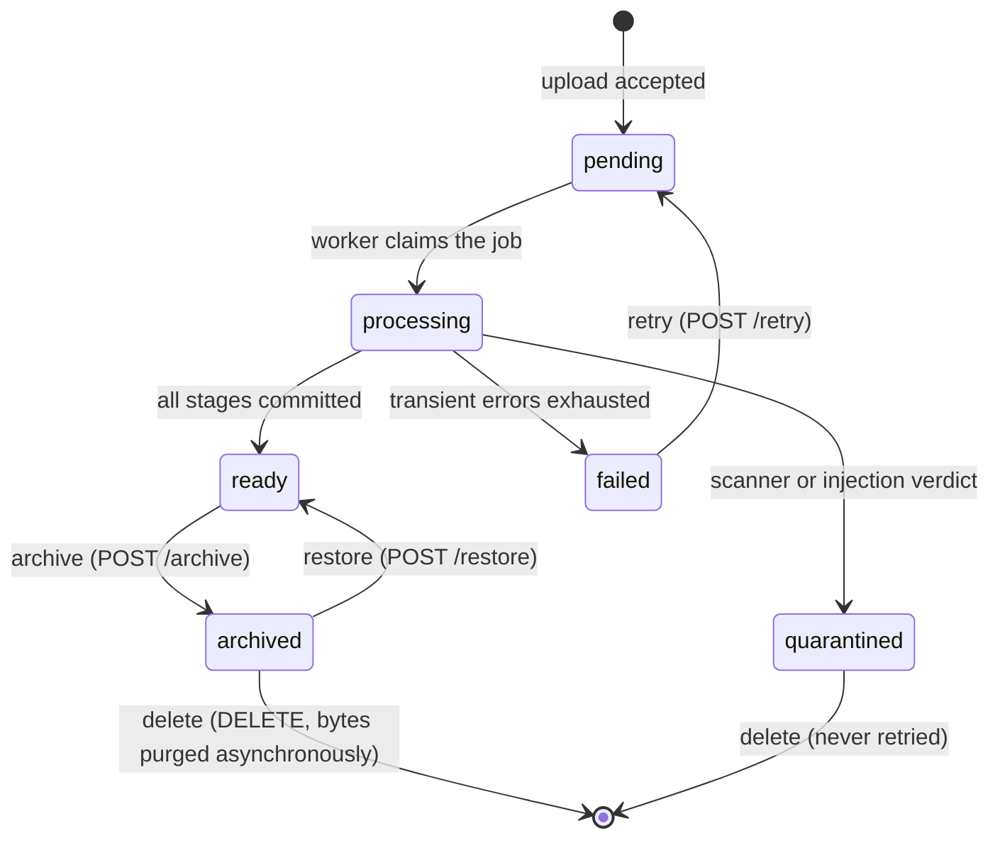

# Architecture

```text
Browser / Next.js
       |
FastAPI API Gateway
       |
Authentication + Workspace Authorization
       |
LangGraph Query Orchestrator
  | query normalization and Tanglish expansion
  | permission-filtered hybrid retrieval
  | multilingual reranking
  | grounded answer generation
  | atomic claim verification
  | confidence calibration and abstention
       |
PostgreSQL + pgvector | Redis | S3/MinIO
       |
Async ingestion workers
validate -> scan -> parse/OCR -> normalize -> chunk -> embed -> index
```

## Trust boundaries

- Uploaded documents, OCR output, webpages, and retrieved chunks are untrusted data.
- Workspace and document permissions must be applied before retrieval results leave the data layer.
- The generation model receives only the smallest evidence set needed for the answer.
- Each material answer claim must map to one or more source spans.
- Unsupported or contradictory claims are removed or cause the system to abstain.
- The MVP is read-only and cannot perform external side effects.

## Initial service boundaries

- `apps/web`: user interface, upload status, chat, citations, reviewer feedback.
- `apps/api`: public API, authentication, authorization, orchestration entry points.
- `services/ingestion`: validation, malware scanning, parsing, OCR, normalization, chunking.
- `services/retrieval`: lexical and dense search, fusion, filters, reranking.
- `services/verification`: claim splitting, evidence verification, contradiction checks, abstention.
- `services/safety`: prompt-injection detection, sanitization, quarantine decisions.

## Language detection and normalization

The query pipeline (`app.language`) turns raw user text into a
`ProcessedQuery` before retrieval, keeping three representations so intent is
never lost:

- `original`: the user's exact input, retained verbatim for provenance.
- `normalized`: Unicode NFC, folded smart/full-width punctuation, and
  collapsed whitespace. Idempotent and safe to index.
- `transliterated`: Tanglish (romanized Tamil) rendered into Tamil script so
  Latin-typed queries can match Tamil-script documents. For Tamil and English
  it repeats `normalized`.

Detection is deterministic and explainable: it measures Tamil-vs-Latin letter
ratios, then disambiguates Latin-only text into English or Tanglish using a
small, auditable marker lexicon. Every result carries a calibrated
`confidence` and a `limitations` list (for example "mixed Tamil and Latin
script" or "ambiguous romanized text"), which downstream retrieval uses to
widen candidates when the signal is weak.

Detection output is untrusted metadata: it informs retrieval and is never fed
to the model as an instruction. Transliteration and spelling normalization sit
behind the `Transliterator` and `SpellingNormalizer` protocols so rule-based
MVP providers can be replaced without touching the orchestration.

## Multilingual embeddings

`app.embeddings` turns chunk and query text into dense vectors behind the
`EmbeddingProvider` protocol, so the local MVP provider can be replaced by a
hosted BGE-M3 deployment without changing persistence or retrieval. Every
provider declares `model`, `model_version`, and `dimensions`, and returns
typed vectors that are validated (count and width) before use.

The MVP ships `LocalHashingEmbeddingProvider`: a deterministic, dependency-free
provider that emits 1024-dim unit vectors (BGE-M3's width) from a hashed
bag-of-features over `app.language`-normalized text. It is a faithful wiring
stand-in (real dimensionality, deterministic per model version, multilingual)
but not a semantic model, so it is used for plumbing and tests, not quality
measurement. Batching and bounded-backoff retries are cross-cutting decorators
(`BatchingEmbeddingProvider`, `RetryingEmbeddingProvider`) that preserve the
provider contract and input order.

Vectors persist in `chunk_embeddings`, one row per chunk per model version, so
a model upgrade adds rows rather than overwriting reproducible provenance. The
table carries a denormalized `workspace_id`, row-level security matching the
other tenant tables, and an IVFFlat cosine index. `ChunkEmbeddingRepository`
is workspace-scoped: persistence checks the chunk belongs to the caller's
workspace, and cosine search filters by workspace and model version so
unauthorized vectors never leave the data layer. Telemetry records counts and
the model, never document text.

The ingestion worker writes those rows. Its `NORMALIZING`, `EMBEDDING`, and
`INDEXING` stages do real work and run in the order `IngestionStage` declares:

- **Normalize** detects each page's language and records it on `pages.language`,
  which the chunker then copies onto every chunk cut from that page. It runs
  before chunking for that reason, and it does *not* rewrite stored text —
  chunk content must stay byte-identical to `page_text[char_start:char_end]`, so
  consumers apply `normalize_for_match` when they compare instead. A page with
  no classifiable letters records `unknown`; `NULL` would mean the stage never
  ran, and that distinction is worth keeping.
- **Embed** reads the persisted chunks back rather than embedding the drafts, so
  a vector exists only for text that reached the table with valid provenance.
- **Index** upserts by chunk and model version, so re-running a job replaces
  vectors instead of accumulating them while a model upgrade still adds a row.

Failure handling splits on whether another attempt could plausibly differ: a
provider returning the wrong vector width is a `PermanentIngestionError`,
because it will do so again on the same input, while every other embedding
failure is transient and retried like any other stage's.

## Permission-filtered hybrid retrieval

`app.retrieval` answers a workspace query by running two retrievers and fusing
their rankings:

- **Lexical**: PostgreSQL full-text search over `chunks.content` using the
  `simple` text-search configuration, ranked with `ts_rank_cd` and backed by a
  GIN expression index (migration 0008). `simple` applies no language-specific
  stemming, so Tamil, English, and romanized Tanglish tokens are indexed and
  matched uniformly. Free-text queries are parsed with `websearch_to_tsquery`,
  which never raises on arbitrary punctuation, so untrusted query text cannot
  cause a parse error or injection.
- **Dense**: pgvector cosine search over `chunk_embeddings` for the query's
  own model version.

The query's `search_variants` (normalized, transliterated, expansions) drive
the lexical side so a Tanglish query can match Tamil-script content. Both
retrievers run through workspace-scoped repositories, so the workspace filter
(and row-level security beneath it) is applied *before* any candidate is
scored: there is no code path that returns a chunk another tenant owns.
Optional `document_id` and `language` filters narrow both sides identically.

Rankings are merged with **Reciprocal Rank Fusion** (`1 / (k + rank)`, default
`k = 60`), a pure, deterministic function that needs only ranks, not
comparable scores, which is exactly right for mixing `ts_rank_cd` relevance
with cosine similarity. Fused ids are hydrated into fully-provenanced results
(document, page, section, offsets, language, OCR) that downstream citation and
verification depend on. Every retrieval emits a structured `RetrievalTrace`
(candidate counts, per-source ranks, fused scores, filters, timings) that
carries no query text, chunk content, or secrets, so it is safe to log and
return. The endpoint `POST /workspaces/{id}/retrieval/search` requires the
`QUERY` capability and clamps caller-supplied `top_k` to a configured maximum.

## Multilingual reranking

`app.reranking` refines the fused candidate order with a cross-encoder-style
reranker behind the `Reranker` protocol, so the local MVP reranker can be
replaced by a hosted `bge-reranker-v2-m3` without touching retrieval. A
reranker scores how well each passage answers the query; `RerankService` then
min-max normalizes those raw scores into `[0, 1]` (so a threshold is
meaningful across models), drops candidates below `RERANK_THRESHOLD`, and
reorders by normalized score with ties broken by chunk id.

The MVP ships `LocalLexicalReranker`: a deterministic, dependency-free reranker
that scores query/passage relevance by blended coverage and Jaccard over
`app.language`-normalized unigrams and character trigrams, so Tamil, English,
and Tanglish are handled with no language-specific tables. It is a lexical
stand-in, not a semantic cross-encoder, so it is used for wiring and tests, not
quality measurement; a labelled multilingual evaluation asserts a minimum
top-1 accuracy and MRR to catch regressions.

Reranking is a stage inside `HybridRetrievalService`: when enabled, fusion
keeps a larger candidate pool (`RERANK_CANDIDATE_LIMIT`) so the reranker can
promote a chunk fusion ranked just outside `top_k`, then the reranked list is
truncated. The reranker only ever sees chunk text that was already authorized
and hydrated, so it can reorder or drop candidates but never widen the result
set or cross a tenant boundary. Failure is safe by construction: if the
reranker raises, the service preserves the fused order (flagged in telemetry)
rather than dropping authorized evidence. The retrieval trace records the
reranker model, latency, and dropped count, never passage text or the query.

## Grounded answer pipeline

`app.rag` turns an authorized query into a **grounded answer or a calibrated
abstention** with a typed [LangGraph](https://langchain-ai.github.io/langgraph/)
state machine. The graph's single state object is a validated Pydantic
`RagState`, so every transition is type-checked and the fields a node may read
or write are explicit. Nodes are small and each returns a partial update that
LangGraph merges back in.

The pipeline is a straight line with three hard gates that cannot be bypassed
because they are the graph's own conditional edges:

```text
authorize ─▶ analyze ─▶ retrieve ─▶ generate ─▶ verify ─▶ compose ─▶ answer
    │                       │                        │
    └── abstain ◀───────────┴── abstain ◀────────────┴── abstain
```

1. **authorize** — the request must carry a proven workspace scope (membership,
   role, and row-level security are already bound by the route dependency);
   otherwise the graph routes straight to abstention and retrieval never runs.
2. **retrieve** — evidence comes only through the workspace-scoped
   `HybridRetrievalService` behind the `EvidenceRetriever` port, so a node can
   only ever see this tenant's chunks. The **evidence-sufficiency gate** then
   abstains unless enough sufficiently-scored passages were found, so
   generation never runs on empty or thin evidence. Only the minimal top
   passages (`RAG_MAX_EVIDENCE`) reach generation.
3. **generate** — the `AnswerGenerator` proposes *candidate claims*, each a
   quote pinned to one supplied passage's `chunk_id`. The MVP `ExtractiveGenerator`
   selects the sentence best covering the query (unigram + character-trigram
   overlap, so English, Tamil, and Tanglish work with no language tables); a
   hosted LLM can replace it behind the same interface.
4. **verify** — the `ClaimVerifier` resolves each candidate's cited passage from
   the authorized set (rejecting any claim that cites an unknown chunk),
   confirms the quote actually occurs in that chunk, and assigns a *calibrated*
   confidence blending retrieval, rerank, OCR, and query-overlap signals rather
   than any model's self-reported score. Only `SUPPORTED` claims survive, so a
   hallucinated or paraphrased quote cannot be cited. The **support gate**
   abstains when nothing survives.
5. **compose** — the answer is assembled from supported claims only, with a
   citation per claim carrying exact provenance (document, version, page,
   section, in-chunk offsets, language). The outcome is `PARTIAL` when some
   candidates were dropped, `ANSWERED` otherwise.

Evidence content is untrusted data end to end: nodes quote, score, and cite it
but never treat anything it says as an instruction. Every run emits a
structured `RagTrace` (gate decisions, counts, outcome, timings, embedded
retrieval trace) that carries no query text, evidence text, answer text, or
secrets, so it is safe to log, return, and persist; `RagService` records it as
an append-only audit event. The endpoint `POST /workspaces/{id}/answer`
requires the `QUERY` capability and clamps caller-supplied `top_k` to
`RAG_MAX_TOP_K`. A deterministic, DB-free evaluation asserts the measurable
promises: answerable multilingual queries ground with exact citations, and
out-of-corpus queries abstain instead of inventing an answer.

## Authentication and workspace UI

The Next.js client never holds a bearer token. Credentials are posted to a server action, which
exchanges them for a token pair against `POST /api/v1/auth/login` and writes both tokens to
`httpOnly`, `SameSite=Lax` cookies (`ag_access`, `ag_refresh`). Every subsequent API call is made by
server code that reads those cookies, so client JavaScript, and therefore an XSS foothold, has
nothing to exfiltrate. The active workspace is remembered the same way (`ag_workspace`) rather than
in browser storage.

```mermaid
sequenceDiagram
  participant B as Browser
  participant N as Next.js server
  participant A as FastAPI
  B->>N: POST credentials (server action)
  N->>A: POST /auth/login
  A-->>N: access + refresh token
  N-->>B: Set-Cookie httpOnly; redirect
  B->>N: GET /workspaces
  N->>A: GET /workspaces (Bearer access)
  A-->>N: 401 not_authenticated
  N->>A: POST /auth/refresh (rotate)
  A-->>N: new pair
  N->>A: retry with fresh access token
  A-->>N: memberships scoped to the caller
  N-->>B: rendered page
```

Access tokens are short lived, so `authorizedRequest` in `apps/web/lib/session.ts` spends the
refresh token **once** when the API answers 401, retries the original call, and clears the session if
either step fails. A cleared session redirects to `/login?expired=1`, which states plainly that the
session expired instead of rendering an empty page.

### Layers

| Module | Responsibility |
| --- | --- |
| `lib/contracts.ts` | Zod schemas mirroring the FastAPI response bodies and the stable error codes |
| `lib/api-client.ts` | One validated fetch per call, returning a discriminated `ApiResult` |
| `lib/session.ts` | Cookie read/write, single silent refresh, `AuthorizedResult` |
| `lib/attest-api.ts` | Typed use cases for the auth and workspace endpoints |
| `lib/permissions.ts` | Read-only mirror of the API role matrix, used for presentation only |
| `app/auth-actions.ts`, `app/workspace-actions.ts` | Server actions that validate input and relay stable codes |
| `middleware.ts` | Cheap cookie presence check that redirects to `/login?next=…` |

### Authorization

Authorization is enforced by the API. `lib/permissions.ts` duplicates the role matrix only so the UI
does not advertise actions the API will refuse; `lib/permissions.test.ts` reads
`apps/api/app/auth/permissions.py` and fails the build if the two drift. The middleware is a
convenience redirect, not a boundary: a forged cookie still fails at the API, and non-membership
returns `workspace_not_found` so workspace existence is never disclosed.

### Explicit states

Loading (`loading.tsx` with `aria-live="polite"`), empty, error, and refusal states are distinct
components rather than a shared blank fallback, matching the product rule that an uncertain outcome
must look uncertain. `AccessNotice` renders `insufficient_role`, `cannot_manage_role`,
`workspace_not_found`, and `rate_limited` with guidance and the stable code.

## Document management UI

The document library is the first place a reviewer sees the ingestion pipeline's own state, so the
guiding rule is that a document which cannot be cited must never look like one that can. Every
`DocumentStatus` has explicit wording in `components/ingestion-state.tsx`, and the badge shown in the
list is the same source of truth as the explanation on the detail page.



### Archival is an evidence boundary, not a UI filter

`documents.archived_at` is a nullable timestamp kept separate from `status`, because status records
the ingestion outcome and must not be rewritten — an archived document stays `READY` with its
provenance intact, so restoring it needs no reprocessing. Eligibility for evidence is one predicate,
`evidence_eligible()` in `apps/api/app/db/models/documents.py`, used by all four retrieval gates:
lexical candidate generation, dense candidate generation, hydration, and citation provenance
resolution. Archiving therefore stops answers immediately rather than merely hiding rows in a list;
`tests/integration/test_retrieval.py` pins that end to end, including the race where a candidate was
selected before the archival.

Quota accounting deliberately still counts archived documents: their bytes remain stored until the
document is deleted, so letting archival free quota would let a workspace exceed its limit.

### Permissions

| Action | Capability | Roles |
| --- | --- | --- |
| List, view, download | `VIEW` | all members |
| Upload, retry a failed ingestion | `UPLOAD_DOCUMENTS` | owner, admin, member |
| Archive, restore, delete | `MANAGE_DOCUMENTS` | owner, admin |

Retrying only reprocesses bytes the workspace already accepted, so it follows the upload capability.
Archiving, restoring, and deleting withdraw or destroy evidence, so they are reserved for owners and
admins. `MANAGE_DOCUMENTS` is a new `WorkspaceAction`; `apps/web/lib/permissions.test.ts` now
enumerates the Python action enum, so a capability added to the API without a mirror fails the build.

### Reprocessing and deletion rules

- **Retry** requires `status == FAILED` and an unarchived document. A quarantined document is never
  reprocessed on request — the verdict is terminal, and retrying would hand rejected content back to
  the pipeline. A pending, processing, or ready document has nothing to retry and a second run would
  race the first over the same rows. The failed job row is kept and a new `QUEUED` job is inserted,
  so failure history survives and the worker's compare-and-set claim still sees a clean row.
- **Retry refuses a permanent failure.** The worker records both exhausted-transient and
  deterministic failures as `FAILED`, so `ingestion_jobs.permanent_failure` distinguishes them. A
  hash mismatch, an unparseable file, or a provenance violation fails identically on every future
  run over the same bytes; admitting those would let a caller queue unbounded doomed work.
- **Retry and delete lock the document row.** Both read it `FOR UPDATE` before branching on its
  state. The worker's claim is a compare-and-set on one job id — that makes duplicate delivery of a
  single job safe, but does not deduplicate two distinct jobs, so two concurrent retries would
  otherwise each enqueue one and two workers would race over the same pages and chunks.
- **Delete** requires the document to be archived first. That state is reversible and has already
  removed the document from evidence, so nothing is destroyed on the strength of one click.
- **Delete is refused while a job is `RUNNING`.** The cascade would remove the row a worker is still
  writing stages to. A merely `QUEUED` job is not blocking: the worker's claim already drops a
  message whose row has gone, and refusing there would make a document undeletable whenever its
  queue is backed up. Because the check and the cascade are not atomic, the worker also treats a
  vanished job as abandoned rather than asserting on it.
- **Delete purges by prefix, not by row.** Every object a document produces lives under one
  server-generated prefix (`apps/api/app/documents/keys.py`): each version's uploaded bytes and,
  with `INGESTION_STORE_PAGE_IMAGES` on, a rendered PNG per page. Purging the prefix rather than
  replaying the rows matters because a page image is written to storage *before* its `pages` row is
  committed — a run that crashed mid-OCR leaves content the database never recorded, and a
  row-driven purge would leave pictures of the document's pages readable forever. The keys the rows
  did know are recorded too, so the uploaded bytes are still removed if a listing call fails.
- **Delete performs no storage call.** Rows and objects cannot be deleted in one transaction, and
  either ordering strands something on failure: a document that still issues download links for
  bytes that are gone, or bytes that outlive their document. So the request commits the row deletion
  together with a durable `storage_purges` record (migration `0011`) and stops there. The sweeper in
  `apps/api/app/documents/purge.py` — run by the ingestion worker whenever it is idle — deletes the
  objects and marks the record complete, retrying until it succeeds. The purge is idempotent by
  construction, since deleting an absent key is a no-op, so an interrupted record is always safe to
  re-run. Like `requeue_stale`, the sweeper scans across workspaces and therefore needs the
  worker's `BYPASSRLS` role; without it purge records stay pending and bytes are retained.

### Upload and download paths

Two Next.js route handlers exist because a server action is the wrong shape for both:

| Path | Why not a server action |
| --- | --- |
| `POST /api/workspaces/[id]/documents` | Only `XMLHttpRequest` reports how much of a request body has been sent, and byte-level progress is the point for a 20 MB scan |
| `GET /api/workspaces/[id]/documents/[docId]/download` | The presigned URL must be reached by a link navigation; `form-action 'self'` in the CSP would refuse a form redirect to the storage origin, and a link also works without client JavaScript |

Both are relays, not authorization points: they exchange the `httpOnly` session cookie for a bearer
token server side and let the API decide. The upload relay forwards only the file part, so no
client-chosen metadata reaches tenant storage, and the presigned URL is minted at click time and
never rendered into HTML.

### Untrusted content

Filenames, titles, and worker error strings all originate in uploaded files. They are rendered as
text children only — the app contains no `dangerouslySetInnerHTML` — and no page previews document
contents: the file's text reaches a reader solely as cited evidence. Regression tests assert that a
filename or ingestion error containing markup produces no element, and that the detail page renders
no `iframe`, `object`, `embed`, or `img`.
