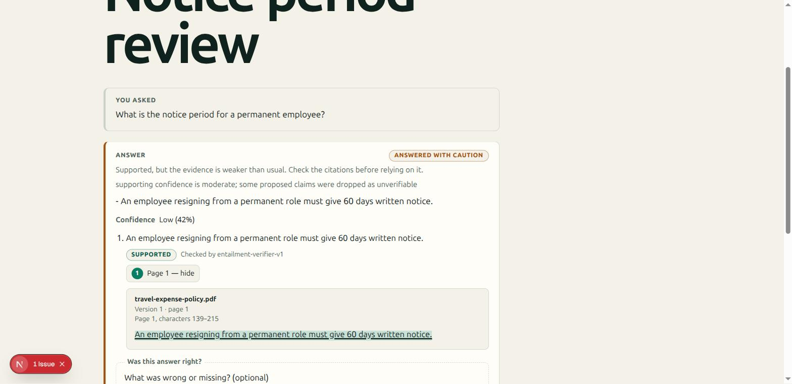

# Design Rationale

Why this is not chat-with-PDF, in the form of the decisions that made it not be — each with the
alternative that was rejected and what the choice cost. If you are reading one document to
understand the system, read this one; if you are reading one to change it, read
[`ARCHITECTURE.md`](./ARCHITECTURE.md).

## The thesis

A retrieval-augmented chatbot over documents is roughly two hundred lines: embed the chunks, search
them, paste the top few into a prompt, stream the answer. That version works, demos well, and is
unfalsifiable — when it is wrong, nothing about the output distinguishes that from when it is
right.

**The failure mode is not that the system is wrong. It is that being wrong looks exactly like being
right.** Everything in this repository follows from taking that seriously: the product's job is not
to answer, it is to be checkable. Fluency is a means; the deliverable is a claim a reader can
verify without trusting the system that made it.

That reframing has consequences that a prompt cannot deliver, because they are properties of a
system rather than of an instruction.

## Ten decisions

### 1. Abstention is a first-class outcome, gated before generation

Most systems answer and hedge. Here, an evidence-sufficiency gate abstains *before* the generator
runs — and it is one of the LangGraph state machine's own conditional edges, so there is no code
path to generation that skips it. There are three such gates: authorization, evidence sufficiency,
and the calibrated decision that follows verification.

**Rejected:** prompting the model to say "I don't know". A model's willingness to refuse is a
disposition, not a guarantee, and it fails exactly when retrieval is thin — the case it exists for.

**Cost:** the system refuses questions a chattier one would attempt. That is measured too:
correctness counts a refusal against us, so refusing everything does not score well.

Three different situations all report `abstained` — no usable evidence, a question that needs
narrowing, evidence that contradicts itself — so the decision, its reason, and the calibrated
confidence are persisted alongside the status. The difference between them is the difference
between "there is nothing here", "ask me differently", and "a human should look at this", and a
thread storing only the status would lose it on reload.

### 2. A citation is a resolvable range, not a reference

A citation carries document, version, page, section, character offsets within the chunk, character
offsets within the page, language, OCR engine, and OCR confidence. Resolving it re-reads
`content[start:end]` from the stored chunk and **refuses if the quote does not match**.

The UI renders that resolved text and never the quote the answer supplied. This is the single most
load-bearing decision in the product: showing a model's version of a passage as though the document
said it is precisely the failure the system exists to prevent, and it is the one that a screenshot
of any other system cannot be distinguished from.

**Rejected:** citing document and page, which is what a reader can check by hand and therefore what
most systems do. It defers the work to the reader, and page-level provenance cannot be verified by
the machine that produced it.

**Cost:** every layer from chunking onward must preserve exact offsets. The chunker is forbidden
from rewriting text — chunk content must equal `page_text[char_start:char_end]` byte for byte —
which means normalization has to happen at read time instead, and every consumer has to know that.

The character range is the whole argument: it is what makes the citation checkable by the machine
that produced it rather than by the reader.

### 3. Confidence is calibrated from signals, never self-reported

Confidence blends retrieval score, rerank score, OCR confidence, and query overlap. A model's own
number is never used.

**This caught a real defect.** The verifier had three OCR states and two branches: born-digital
text and a recorded confidence were handled, and everything else fell through to `1.0` — including
a scanned page whose engine reported *no* confidence at all. The comment directly above said a
missing value must not be treated as perfect. Unknown reliability is strictly less information than
a measured score, so it now takes an explicit `unknown_ocr_confidence` of 0.5: below a good scan,
above a bad one, and deliberately not zero, since an engine that reports nothing still produces
usable evidence.

### 4. Document text is an actor, not a payload

Uploaded files, OCR output, and retrieved chunks are untrusted at every hop. Injection scanning
happens during ingestion, **before chunk persistence** — a quarantine verdict writes no chunk rows
at all, and a chunk is the only unit retrieval can return — and retrieval independently excludes
non-`READY` documents, so content quarantined after chunking still cannot reach an answer.
Quarantine is terminal at every role. It withholds content from answers rather than erasing it:
the uploaded bytes and the extracted page text are already stored by the time the scan runs.

**Rejected:** a prompt boundary ("the following is data, not instructions"). A delimiter is a
request; a pipeline stage that never persists the chunk is a property.

The more important half is structural. The MVP is read-only, has no tools, makes no outbound calls,
and generates extractively. A successful injection's ceiling is influencing *which authorized
passage gets quoted* — it cannot exfiltrate, call anything, or invent a citation, because the
verifier resolves every quote against the authorized chunk set. Detection is defence in depth on
top of a blast radius that was made small first.

### 5. Authorization lives in the data layer, three times over

A route proves membership and checks one capability; repositories scope every query by
`workspace_id`; PostgreSQL row-level security fences the tables underneath both. Retrieval applies
the filter *before* candidates are scored, so no code path ranks a chunk another tenant owns.

**Rejected:** filtering results after retrieval. That works until one caller forgets, and the
failure is silent.

Non-membership returns `404`, never `403`, so workspace existence cannot be probed. Archiving is a
reversible timestamp rather than a status rewrite, and evidence eligibility is **one predicate**
used by all four retrieval gates — so archiving a document stops answers immediately instead of
merely hiding rows in a list. That distinction is the whole difference between a UI filter and a
security boundary.

### 6. The tokenizer is a correctness decision, and it was wrong

`[^\W_]+` is the idiom everyone reaches for. Python's `\w` covers letters and digits but **not** the
Unicode mark categories — and a Tamil vowel sign is a spacing combining mark. So `விமான` tokenizes
to `வ`, `ம`, `ன`: three bare consonants. Two unrelated Tamil passages then share most of their
"tokens", and every lexical score built on them inflates.

It was in six modules simultaneously — generation, verification, verification signals, reranking,
embeddings, and the evaluation harness — because it is a single idiom, not six mistakes. In the
evaluation corpus an airfare question and a leave-accrual passage scored 0.5 overlap. **The Tamil
numbers were excellent for entirely the wrong reason.**

Two things about the fix matter more than the fix. First, `EMBEDDING_MODEL_VERSION` moved with it
(`hashing-v1` → `hashing-v2`), because the version salts the hashing trick and scopes every vector
search — leaving it would have compared vectors built from consonant fragments against queries
built from whole words, and returned plausible wrong neighbours with nothing to report it. Second,
the evaluation could not have caught a regression here, because the harness substitutes the
retriever; so the regression contract is a separate suite that pairs Tamil sentences sharing
nothing and asserts each module can tell them apart.

Multilingual support is not a model choice. It is a hundred decisions like this one.

### 7. The evaluation is a contract, and it is allowed to fail

Datasets are digest-pinned in a manifest, thresholds live in one file so lowering one is a legible
diff, and the committed baseline is asserted equal to a fresh run — so the numbers in the docs
cannot quietly become fiction. An unmeasurable metric is `null` and does **not** clear its floor,
because treating an absent number as satisfied turns an empty dataset into a green build.

Abstention recall sits at 0.86, above its declared floor of 0.80 — so the suite passes and the
**case is still left failing**. One unanswerable question in seven —
"what is the training budget for the marketing team" — retrieves a passage that mentions training
budgets without answering, and the pipeline answers from it. No threshold fixes that; it needs
semantic matching rather than lexical overlap. Adjusting the dataset until it passed would have
been a two-line change, and it would have destroyed the only thing the dataset was for.

### 8. Providers are interfaces, and the MVP ships honest stand-ins

Embeddings, reranking, OCR, generation, verification, and malware scanning are all protocols. The
MVP implements each locally and deterministically: a hashing embedder at BGE-M3's real width, a
lexical reranker, an extractive generator, an EICAR-only scanner.

They are labelled as stand-ins everywhere they appear — in the docs, in the module docstrings, in
the evaluation's own limitations. A stand-in described as a model is a lie about the system's
capability; a stand-in described as a stand-in is a wiring decision. The scanner is called *"a
placeholder, not protection"* in the security documentation for the same reason.

**Cost:** absolute quality numbers are not meaningful yet. The thresholds are a regression contract
for the pipeline's logic, not a forecast of production retrieval. That is stated where the numbers
are, not in a footnote.

### 9. Operational failure modes are designed for, not discovered

A representative sample, each of which came from asking "what does this look like when it breaks":

- **The worker is in the Compose file.** Without it, uploads are accepted and never processed while
  the API stays genuinely healthy. It is the most plausible way to ship a broken product that looks
  entirely fine.
- **Delete makes no storage call.** Rows and objects cannot share a transaction and either ordering
  strands something, so the row deletion commits with a durable purge record and a sweeper retries
  afterwards. A storage outage delays a purge instead of leaving a document whose bytes are gone.
- **The purge sweeps a key prefix, not the keys the rows knew.** A page image reaches storage
  before its row commits, so a run that crashed mid-OCR leaves pictures of the document's pages
  that a row-driven purge would never find.
- **Turn order is a stored sequence.** A question and its answer are written in one transaction and
  PostgreSQL's `now()` is transaction-start time, so ordering by `created_at` would let SQL return
  the answer before the question.
- **Backups capture the database and object store as a pair.** Restoring Tuesday's rows beside
  Thursday's objects makes citations resolve to the *wrong text* — no error, no failed check,
  answers that look grounded and are not. Nothing downstream can detect it.
- **Redaction lives in the log formatter, keyed on field name.** A token and a document id are both
  opaque strings, so classification at the call site is a decision every future caller has to
  repeat correctly. An unrecognised field is fingerprinted, so a new one fails closed.

### 10. Two programs, one pinned contract

The web app restates every API response as a Zod schema — a deliberate choice (no generator in the
browser bundle, and the client can be stricter than the server). A mirror that drifts is worse than
none: it either rejects a valid response, so the page reports a transport failure for data that
arrived intact, or accepts a field that never comes and renders nothing.

**That failure already happened once**: a required `document_id` on the citation mirror, which the
API deliberately does not return, made every stored conversation fail validation. A reviewer caught
it; no test did.

So the API generates an OpenAPI document about itself, it is committed, and three tests pin to it —
one fails if the file drifts from the application, one if a Zod schema has a field the API does not
return, one if the app requests a path the API does not serve. The role matrix and the upload
validator are mirrored the same way, with tests that read the Python source.

## What this system does not do

Stated here so the list above is read as a set of trade-offs rather than a set of claims. The full
version is in [`ROADMAP.md`](./ROADMAP.md).

- The models are local stand-ins. Retrieval quality is not yet a meaningful number.
- The malware scanner recognises one test signature.
- Rate limiting is in-process, so it is per-replica.
- Abstention recall is 0.86, and one known question class is answered when it should not be.
- There is no reindex, so changing the embedding version means re-ingesting a workspace.
- The worker exports no metrics, so its alerts cannot fire yet.
- The backup and restore scripts have not been run against a real deployment.

## If you have five minutes

The three things worth looking at, in order:

1. **`apps/api/app/rag/graph.py`** — the gates are conditional edges, so "it cannot skip
   verification" is a property of the graph rather than a claim about the code.
2. **`apps/api/app/citations/resolver.py`** — a citation is proven by re-reading the source, and
   refused when it does not match. Then `apps/web/components/` for what the reader is shown.
3. **`docs/EVALUATION.md`**, the *Known limitations* section — the argument for taking the rest of
   the numbers seriously is that this section exists and is not empty.
