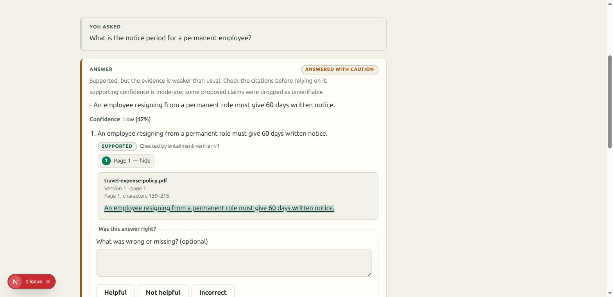
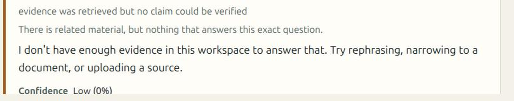
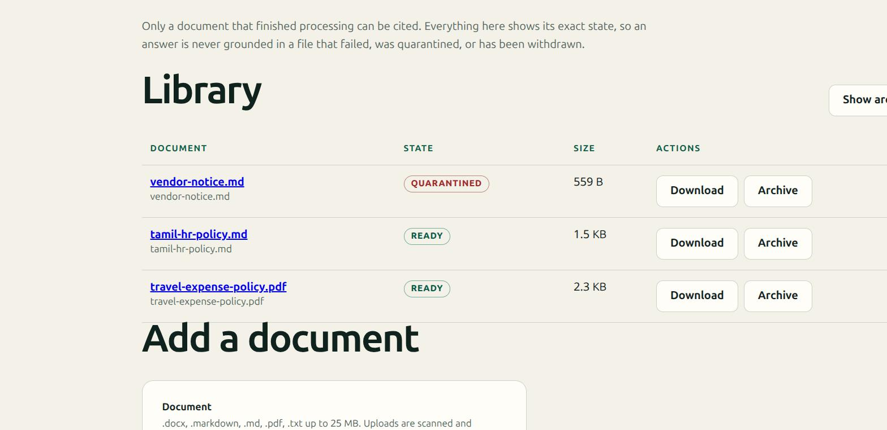

# Screenshots

Four of the ten are captured, from a real local stack — the API, the ingestion worker, PostgreSQL,
Redis, and MinIO, with synthetic documents. The rest are named below with what they must show, so a
screenshot added later documents something rather than decorating a page.

Add a file under the exact name below, then reference it from the linked document. Until a file
exists, do not add its image link — a broken image is worse than an absent one, and
`apps/api/tests/test_documentation.py` fails the build both on a link to a file that is not there
and on an image committed here that no document renders.

## Captured

### `04-answer.png` — a grounded answer

The claim carries `SUPPORTED` and the verifier that produced it (`entailment-verifier-v1`), not a
bare assertion. Confidence is banded — *Low (42%)* — because a bare percentage invites false
precision, and the caution badge is keyed on the decision rather than the status.

### `05-evidence-panel.png` — the citation resolved against stored content

The most important capture in the set. `Page 1, characters 139–215` is the citation's range, and the
highlighted text was read back from the stored chunk at those offsets by `/citations/resolve` —
not supplied by the answer. A quote that did not match would render a failure here instead of a
passage.

### `07-abstention.png` — a refusal that says which kind it is

*"There is related material, but nothing that answers this exact question"* — the
`ask_for_clarification` decision, distinct from "there is nothing here" and from "a human should
look at this". Confidence is `0%`, which a reader must take as an absence rather than a score.

Cropped to the card from a full-page capture; nothing else is altered. Worth retaking full-frame
alongside `09-archived.png`, since the two belong side by side.

### `08-quarantine.png` — quarantine is terminal

`vendor-notice.md` carried an injected instruction and was quarantined during ingestion, before any
chunk was persisted. Note what the row does **not** offer: there is no retry control, because the
verdict is terminal at every role.

## Still to capture

| File | Scene | Must show | Belongs in |
| --- | --- | --- | --- |
| `01-roles.png` | 1 | The same workspace as a viewer and as an owner, side by side — no composer, no upload control for the viewer | `DEMO.md`, `ARCHITECTURE.md` |
| `02-ingestion.png` | 2 | The document detail page mid-run, with a named stage and the attempt count | `DEMO.md` |
| `03-upload-rejected.png` | 2 | An upload refused with a stable code (`content_mismatch` or `unsupported_file_type`) | `DEMO.md`, `SECURITY.md` |
| `06-tanglish.png` | 4 | A romanized-Tamil question answered from a Tamil-script document, with the Tamil citation legible. No longer blocked — the transliterator was fixed, and `eettiya viduppu ethanai naal` now answers from the Tamil leave policy | `README.md`, `DEMO.md` |
| `09-archived.png` | 7 | The same question abstaining after the source document was archived | `DEMO.md` |
| `10-evaluation.png` | 8 | `make evaluate` output with the thresholds table and the abstention line | `README.md`, `EVALUATION.md` |

## Rules for a capture

- **Synthetic content only.** No tenant document, no personal data, no real credential, no real
  email address. The demo corpus is written for this purpose; use it.
- **Redact nothing after the fact.** If a capture would need redacting, retake it with synthetic
  data — a black box over a field is an invitation to look for the original.
- **No tokens or ids that resolve.** Presigned URLs, bearer tokens, and workspace ids must not be
  legible; keep them out of the frame rather than blurring them.
- **Light theme, 1440px wide, PNG.** Consistent framing makes two captures comparable.
- **A capture must show a claim this project makes.** If it only shows that the app renders, it is
  not worth the diff.
